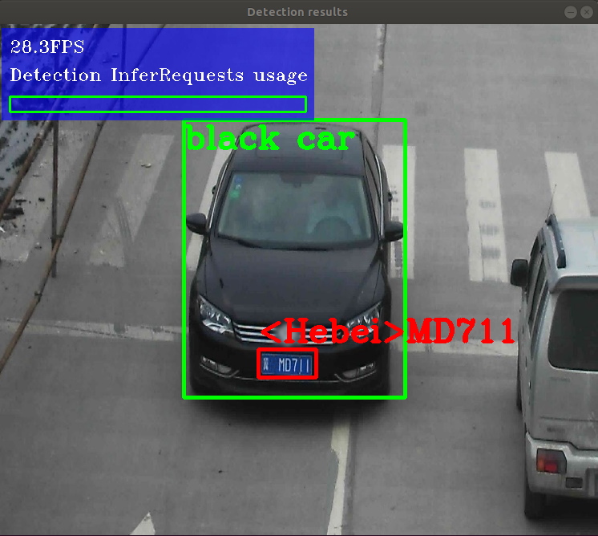

# OpenVINO Docker

Collection of Dockerfiles that will provide you with a base environment to build and run your inference models with [Intel® OpenVINO™ Toolkit](https://docs.openvinotoolkit.org/)

OpenVINO can be installed downloading the installation files from the official web, using the [Docker Hub images](https://hub.docker.com/u/openvino), using YUM or APT packages.

These Dockerfiles uses the APT package on top of Ubuntu 18.04

## Building the Docker Images

``` bash
docker-compose build
```

This will build the following images:

``` bash
REPOSITORY                          TAG                 IMAGE ID            CREATED             SIZE
sampleapp-runtime                   latest              199338615d9e        2 minutes ago       375MB
sampleapp-dev                       latest              99298ab0a7e3        3 minutes ago       1.74GB
openvino-dev                        2021.1              e1462a646c16        4 minutes ago       718MB
openvino-runtime                    2021.1              f9b55d3ad15e        5 minutes ago       562MB
ubuntu                              18.04               c3c304cb4f22        3 weeks ago         64.2MB
```

* **ubuntu**: is the base image
* **openvino-runtime**: is the runtime OpenVINO image based on APT package *intel-openvino-runtime-ubuntu18-2021.1.110*. Includes the following modules:

``` bash
  Depends: intel-openvino-docs-2021.1.110
  Depends: intel-openvino-eula-2021.1.110
  Depends: intel-openvino-gstreamer-rt-ubuntu-bionic-2021.1.110
  Depends: intel-openvino-gva-rt-ubuntu-bionic-2021.1.110
  Depends: intel-openvino-ie-rt-2021.1.110
  Depends: intel-openvino-ie-rt-core-ubuntu-bionic-2021.1.110
  Depends: intel-openvino-ie-rt-cpu-ubuntu-bionic-2021.1.110
  Depends: intel-openvino-ie-rt-gna-ubuntu-bionic-2021.1.110
  Depends: intel-openvino-ie-rt-gpu-ubuntu-bionic-2021.1.110
  Depends: intel-openvino-ie-rt-hddl-ubuntu-bionic-2021.1.110
  Depends: intel-openvino-ie-rt-vpu-ubuntu-bionic-2021.1.110
  Depends: intel-openvino-ie-sdk-ubuntu-bionic-2021.1.110
  Depends: intel-openvino-opencv-generic-2021.1.110
  Depends: intel-openvino-opencv-lib-ubuntu-bionic-2021.1.110
  Depends: intel-openvino-setupvars-2021.1.110
  ```

* **openvino-dev**: is the development OpenVINO image including all the components and based on APT package *intel-openvino-dev-ubuntu18-2021.1.110*. Inludes the *openvino-runtime* modules with the addition of:

``` bash
  Depends: intel-openvino-dl-workbench-2021.1.110
  Depends: intel-openvino-gva-dev-ubuntu-bionic-2021.1.110
  Depends: intel-openvino-gva-sdk-2021.1.110
  Depends: intel-openvino-ie-bin-python-tools-ubuntu-bionic-2021.1.110
  Depends: intel-openvino-ie-samples-2021.1.110
  Depends: intel-openvino-model-optimizer-2021.1.110
  Depends: intel-openvino-omz-dev-2021.1.110
  Depends: intel-openvino-omz-tools-2021.1.110
  Depends: intel-openvino-opencv-etc-2021.1.110
  Depends: intel-openvino-pot-2021.1.110
  ```

* **sampleapp**: is a sample application using the OpenVINO Toolkit.

## Using the image

### Run a sample application

We will run the [security barrier demo](https://docs.openvinotoolkit.org/2020.2/_demos_security_barrier_camera_demo_README.html) included with OpenVINO, in a separate container.

``` bash
docker-compose run sampleapp-runtime
```

The inference output should be visible in the terminal:

``` bash
$ docker-compose run sampleapp-runtime 
[setupvars.sh] OpenVINO environment initialized
[ INFO ] InferenceEngine: 0x7f8c44aaf030
[ INFO ] Files were added: 1
[ INFO ]     /opt/intel/openvino/deployment_tools/demo/car_1.bmp
[ INFO ] Loading device CPU
	CPU
	MKLDNNPlugin version ......... 2.1
	Build ........... 42025

[ INFO ] Loading detection model to the CPU plugin
[ INFO ] Loading Vehicle Attribs model to the CPU plugin
[ INFO ] Loading Licence Plate Recognition (LPR) model to the CPU plugin
[ INFO ] Number of InferRequests: 1 (detection), 3 (classification), 3 (recognition)
[ INFO ] 4 streams for CPU
[ INFO ] Display resolution: 1920x1080
[ INFO ] Number of allocated frames: 3
[ INFO ] Resizable input with support of ROI crop and auto resize is disabled
Invalid MIT-MAGIC-COOKIE-1 keyUnable to init server: Could not connect: Connection refused

(Detection results:13): Gtk-WARNING **: 08:35:06.722: cannot open display: :0

```

### Run the the container with X enabled (Linux)

This sample uses OpenCV to desplay the resulting frame with detections rendered as bounding boxes and text. For running a sample application that displays an image, you need to share the host display to be accessed from guest Docker container.

First the X server on the host should be enabled for remote connections (note that this turns off access control):

``` bash
xhost +local:docker
```

The following flags needs to be added to the docker run command:

* --net=host
* --env="DISPLAY"
* --volume="$HOME/.Xauthority:/root/.Xauthority:rw"

This is already added in the docker-compose.yml:

``` bash
    volumes:
      - $HOME/.Xauthority:/root/.Xauthority
    network_mode: host
    environment:
      - DISPLAY
```

Now, run again the sample app and you will see the screen output



When finished, disable the remote connections to the X server

``` bash
xhost -
```

### Use the image in another container

You can use this Docker image as a base image and use it in multiple Dockerfiles. Use multi-stage with *openvino-dev* and/or *openvino-runtime* image in your Dockerfile.

In general, openvino-dev would be used when using:

* Deep Learning Workbench
* Gstreamer Video Analytics development and SDK
* Infrence Engine Python tools and Samples
* Model Optimizer
* OpenVINO Model Zoo Tools
* Intel® Post Training Optimization Tool

Otherwise, openvino-runtime may be used

``` bash
## Development build
FROM openvino-dev:2021.1.110 as sampleapp-dev

RUN <Application build steps, Model Download, Model Optimization, etc>
RUN <Deployment Tool>

##  Runtime Build

FROM ubuntu:18.04

COPY --from=sampleapp-dev <Application Biuld>
COPY --from=sampleapp-dev <Models and data>

CMD ["/myapp"]
```

An example of this process is shown in sample-app folder
