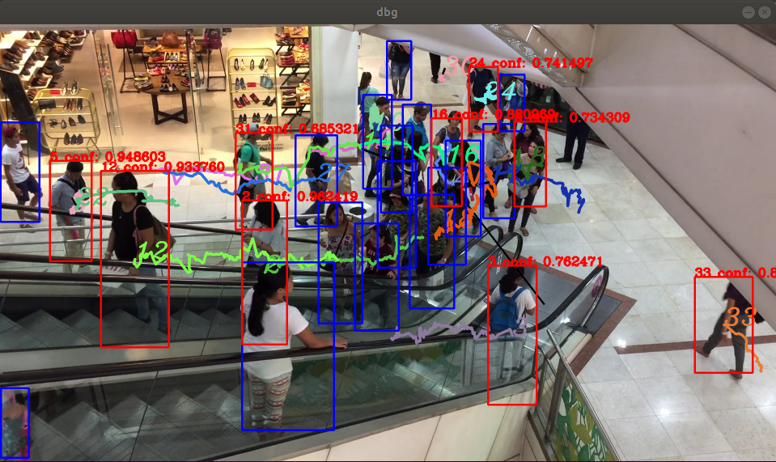
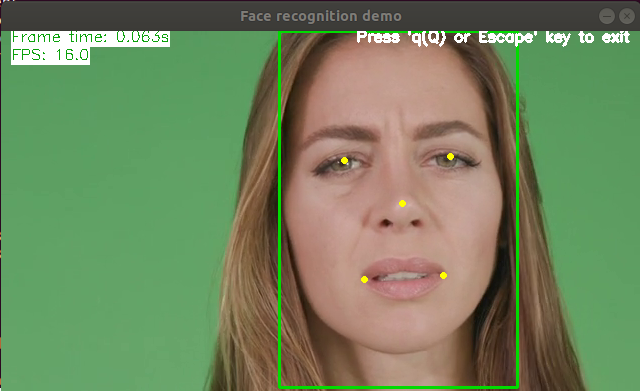

# OpenVINO Demos

OpenVINO includes several [demo applications](https://docs.openvinotoolkit.org/latest/_demos_README.html) that shows how to use the Inference Engine for specific use cases. Here you will find how to run these applications in a Docker Container.

## Build the Docker images

```bash
docker-compose build
```

This will generate the following images:

```bash
face-recognition-dev                 latest              6012528c8bf8        54 minutes ago      1.44GB
pedestrian-tracker-dev               latest              fe1bafee0eed        About an hour ago   1.39GB
```

### Pedestrian Tracker C++ Demo

This demo showcases Pedestrian Tracking scenario: it reads frames from an input video sequence, detects pedestrians in the frames, and builds trajectories of movement of the pedestrians. For more information read the [OpenVINO Pedestrian Tracker documentation.](https://docs.openvinotoolkit.org/latest/_demos_pedestrian_tracker_demo_README.html)

#### Video

The demo is expecting a video in video/video.mp4, so you can place your own video or use download the following public video of a mall:
https://www.pexels.com/video/a-day-at-the-mall-1338598/

#### Run the sample

Since this sample application uses the display to show the output, we need to share the host display with the guest container.

The X server on the host should be enabled for remote connections:

```bash
xhost +
```

Now you can run the sample:

```bash
docker-compose run -rm pedestrian-tracker
```

The sample should display the video with the detections on it:



#### Customizations

Note that the container runs the script pedestrian-tracker.sh which executes the demo with a set of arguments:

```bash

VIDEO="${VIDEO:-/app/videos/video.mp4}"

source /opt/intel/openvino/bin/setupvars.sh && \
    /root/omz_demos_build/intel64/Release/pedestrian_tracker_demo \
  -i $VIDEO \
  -m_det /app/models/intel/person-detection-retail-0013/FP32/person-detection-retail-0013.xml \
  -m_reid /app/models/intel/person-reidentification-retail-0031/FP32/person-reidentification-retail-0031.xml  \
  -d_det CPU
```

You can update the video used by setting the VIDEO environment variariable when running the docker-compose:

```bash
VIDEO=/app/videos/video1.mp4 docker-compose run pedestrian-tracker
```

You can also point to an online video stream.

### Interactive Face Recognition Demo

This demo uses 3 models to build a pipeline able to detect faces on videos, their keypoints (aka "landkarks"), and recognize persons using the provided faces databases (the gallery)

 For more information read the [OpenVINO Interactive Face Recognition Demo.documentation](https://docs.openvinotoolkit.org/latest/_demos_python_demos_face_recognition_demo_README.html)

#### Video

The demo is expecting a video in video/video.mp4, so you can place your own video or use download the following public video of a face:
https://www.pexels.com/video/close-up-of-a-woman-showing-different-facial-expressions-3063839/

#### Run the sample

Since this sample application uses the display to show the output, we need to share the host display with the guest container.

The X server on the host should be enabled for remote connections:

```bash
xhost +
```

Now you can run the sample:

```bash
docker-compose run -rm face-recognition
```

The sample should display the video with the detections on it:



#### Customizations

Note that the container runs the script face-recognition.sh which executes the demo with a set of arguments:

```bash

#!/bin/bash

VIDEO="${VIDEO:-/app/videos/video.mp4}"

source /opt/intel/openvino/bin/setupvars.sh && \
 python3  /opt/intel/openvino/inference_engine/demos/python_demos/face_recognition_demo/face_recognition_demo.py \
  -i $VIDEO \
  -fg /app/images \
  -m_fd /app/models/intel/face-detection-adas-0001/FP32/face-detection-adas-0001.xml \
  -m_lm /app/models/intel/landmarks-regression-retail-0009/FP32/landmarks-regression-retail-0009.xml \
  -m_reid /app/models/intel/face-reidentification-retail-0095/FP32/face-reidentification-retail-0095.xml
```

You can update the video used by setting the VIDEO environment variariable when running the docker-compose:

```bash
VIDEO=/app/videos/video1.mp4 docker-compose run face-recognition
```

You can also point to an online video stream or a webcam using /dev/video0 in the $VIDEO env variable.
...

More Demos to come.
